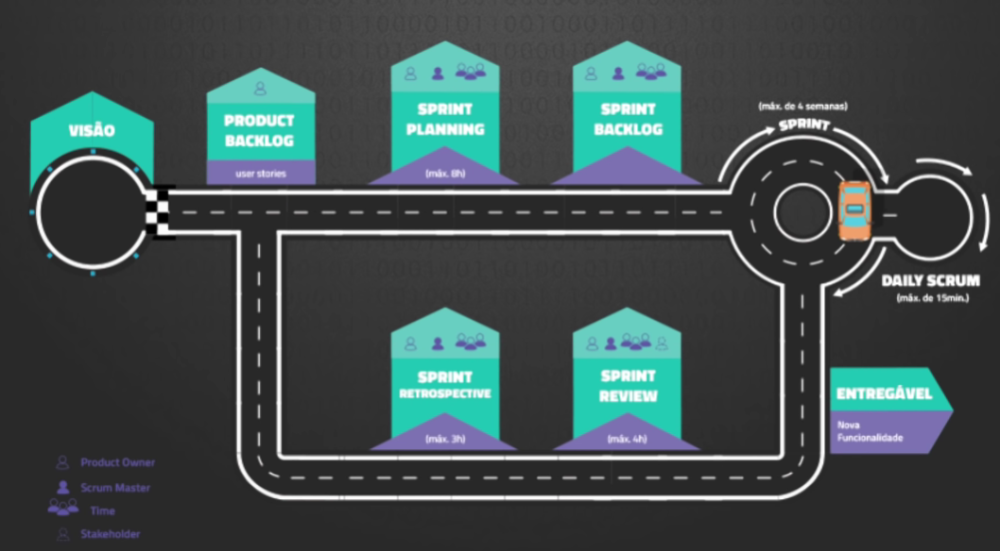

# Métodos ágeis

# Agile

## Principios

- Entrega continua e adiantada de software de valor agregado.
- Mudanças nos requisitos, mesmo que tardiamente no desenvolvimento.
- Entregar frequêntemente software funcionando em pouca escala de tempo.
- Pessoas de negócio e desenvolvedores devem trabalhar em conjunto.
- Construir projeto com índividuos motivados.
- Conversa face-a-face.
- Software funcionando é medida primária.
- Desenvolvimento sustentavel. (Manter ritmo constante)
- Continua atenção, excelência técnica e designer.
- Simplicidade.
- Melhores arquiteturas por equipes organizadas
- Intervalos regulares para reflexão e refino.

Não há um lançamento certo, entregando funcionando o tempo todo!
Pessoas, não processos, estão em primeiro lugar.
Não é definido interações!

# Kanban

Framework de etapas para um processo ser concluído.

- Tamanho de demanda (cards Do)
- Gargalo
- Tempo médio para entrega

# Scrum

Metodo ágil
Fazer de acordo com a necessidade do cliente.
Pega todo produto, divide em partes menores para poder entregar.

## Cerimônias

- Sprint
Ciclo de desenvovimento que tem tempo para termina-lo.
Tempo curto para desenvolver.

- Planejamento do sprint
Montar itens que pode entregar na semana.

- Daily Scrum
Reunião diária de alinhamento

- Revisão de Sprint
Mostrar o que foi entregue, para aprovação

- Retrospectiva de Sprint
O que deu certo, pode melhorar? Documentação.

## Personas do Scrum

- Product Owner
Gerente de produto, que liga o mercado, consumidor e produto.
Traz visão pelo entendimento que ele tem.
Representante do cliente

- Scrum Master 
Papel didático e consultivo
Lider que fácilita do trabalho

- Time
Entrega os itens, prevê entregas e contribui para melhoria de entrega.

## artefatos

### Backlog

Product Owner é responsável

- Product backlog
Lista de requisitos da aplicação.

- Sprint Backlog
Informações necessárias para terminar algo.
Coloca as 'tarefas'.

#### Em vez de tarefas, faça estórias!

### Burndown

Gráfico de trabalhos que precisam ser ou já foram feitos.
Para mostrar o progresso.

# Design Thinking

Método para desenvolvimento de novos produtos.
Forma de pensar, procura atender o usuário.
Não é um processo linear.

## Inspiração

 - Processo de empatia.
Entendimento das necessidades, entendendo o cenário.

## Ideação ou definição

 - Brainstorm.
Criar ideias.

## Prototipagem

Implementação das ideias para entregar testes.
 - Escrever
 - Desenhar
 - Modelagem

## Teste

MVP - Mínimo produto viável
Entregar o MVP para avaliar o retorno e aceitação.

## Buscar
 - Desejabilidade
 - Viabilidade
 - Possibilidade